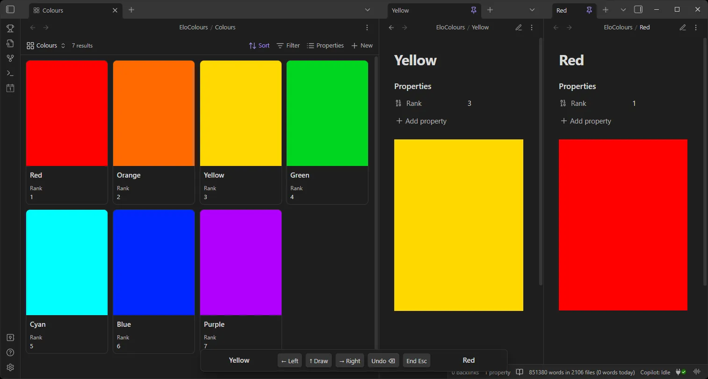
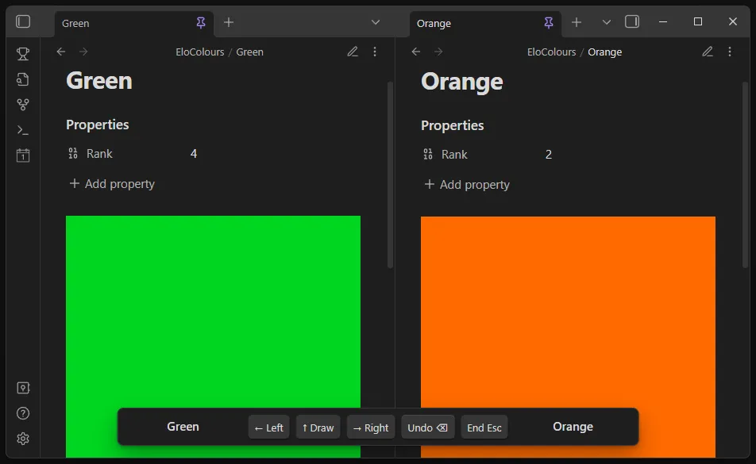

# Pairwise Elo ranking for your notes
Easily sort notes by arbitrary and subjective standards - Rank cohorts of notes in your vault by pairwise comparisons using the Elo rating system.



**How would you sort these notes by colour without manually assigning them all a rank? What if you needed to do this for hundreds of notes?**

Pairwise comparisons are much easier: given two notes, which do you prefer? By repeatedly choosing between pairs, a meaningful ranking quickly emerges.

This plugin was conceived with Obsidian Bases in mind: pick a Base (and optionally view) and rank the notes it returns by pairwise comparisons using Elo. The new Bases plugin API hasn't been released yet, so direct Base integration isn't available today. In the meantime, you can define cohorts by folder, tags, or the whole vault. The full rating workflow is available right now. When the API lands, Bases will become the headline way to define "what's in scope" for a ranking.

- Start quickly from the ribbon icon or Command Palette
- Efficiently review and pick a winner with keyboard shortcuts and an unobtrusive on-screen bar
- Per-cohort stats can be written to frontmatter
- Advanced convergence and matchmaking heuristics you can tune
- Robust to renames and moves via stable per-note Elo IDs
- Cohorts are saved so you can resume ranking sessions, picking up where you left off

Primary roadmap item: Bases will be supported as another cohort type. If you use Bases today, think of your Base (or a specific view) as the future cohort selector.

## Quick start

### Start a session


- Click the trophy icon in the left ribbon, or run the command "Start rating session".
- Create a cohort in the picker:
  - Vault: All notes
  - Active folder (with or without recursive subfolders)
  - Pick a folder...
  - Tag cohort (match Any or All of selected tags)
  - Previously saved cohorts appear here too

### Compare two notes


Two notes open side-by-side in Reading mode for you to compare. Use the arrow keys on your keyboard or the buttons on the session bar to choose a winner.
- Left Arrow: choose left
- Right Arrow: choose right
- Up or Down Arrow: draw
- Backspace: undo last match
- Escape: end the session

A toast shows the winner after each comparison (toggle in Settings).

### End the session  
Press Escape or run "End current session". If you've enabled a Rank property for this cohort, the plugin recomputes ranks across the cohort and writes them to frontmatter.

### Configurable Frontmatter Output


Use the values computed by the plugin however you want. Choose which values get written to frontmatter and what their property names are.

## What's a cohort?

A cohort is the set of notes you're ranking together. Available today:

- Vault: all Markdown notes
- Folder: a single folder only
- Folder (recursive): a folder and all subfolders
- Tag (any): notes that match any of the selected tags
- Tag (all): notes that match all of the selected tags
- Manual list of notes (advanced; not created from the picker yet)

Bases (coming soon): a Base, optionally scoped to a specific view, will be the first-class cohort type. The cohort picker will list Bases alongside the options above. Saved cohorts can be renamed and reconfigured in Settings.

If a folder cohort is later moved or renamed, the plugin will prompt you to point it to the new location and will suggest likely folders based on the notes it can still find.

## Frontmatter and Elo IDs

Each note that participates in a session gets a stable Elo ID so your ratings survive file moves and renames.

- Where: by default in frontmatter as eloId; you can choose to store it at the end of the note as an HTML comment instead.
- When: IDs are created lazily the first time a note is shown in a session.

Example (frontmatter):

```yaml
---
eloId: 123e4567-e89b-12d3-a456-426614174000
eloRank: 7
eloRating: 1612
eloMatches: 19
eloWins: 12
---
```

Example (anywhere in the body of a note, but appended to the end by default):

```markdown
<!-- eloId: 123e4567-e89b-12d3-a456-426614174000 -->
```

Per-note statistics you can write to frontmatter (all optional, names customisable):
- Rating
- Rank (1 = highest within the cohort)
- Matches
- Wins

Stats are written to just the two notes involved after each match. Rank across the whole cohort is recomputed and written when you end the session (if enabled for that cohort).

**Tip:** Configure global defaults in Settings, and (optionally) set per-cohort overrides when creating or editing a cohort. When you change property names or enable/disable them, the plugin can bulk-update, rename or remove the affected properties across the cohort with a confirmation preview.

## Matchmaking and convergence

You can get good rankings faster with a few light-touch heuristics. All have sensible defaults and can be toggled in Settings.

- K-factor: Base speed of rating changes (default 24)
- Provisional boost: Use a higher K for a note's first N matches (default on)
- Decay with experience: Gradually reduce K as a note gains matches (optional)
- Upset boost: Increase K when a much lower-rated note wins (default on)
- Big-gap draw boost: Increase K for draws across a large rating gap (default on)

Pair selection heuristics (default on):
- Prefer similar ratings: sample candidates and pick the closest rating
- Bias towards fewer matches: give newer notes slightly more airtime to help them find their place quickly
- Occasional upset probes: every so often, try a large rating gap to flush out surprises

## Use Elo Properties in Bases

Even before the Base cohort integration is available, you can use the properties this plugin outputs (Rank, Rating, Matches, Wins) inside Bases to filter, sort and display your lists.

- Sort by your subjective rank - In a view's ordering, sort by Rank to show best-ranked first.
- Filter by experience - Only include notes with at least N matches, or rating above a threshold.
- Display columns/cards - Show Rank, Rating, Matches or Wins as columns in a table or as badges on cards.

Demo Rainbow Base used in these screenshots:
```yaml
filters:
  and:
    - file.ext.lower() == "md"
    - file.inFolder("EloColours")
formulas:
  firstImageEmbed: file.embeds.filter(value.asFile() && ["png","jpg","jpeg","gif","webp","svg","bmp","avif","tif","tiff"].contains(value.asFile().ext.lower()))[0]
  cover: if(formula.firstImageEmbed, image(formula.firstImageEmbed.asFile()))
views:
  - type: cards
    name: Colours
    order:
      - file.name
      - Rank
    sort:
      - property: Rank
        direction: ASC
    image: formula.cover
```

This closes the loop:
- Bases define the cohort
- Pairwise Elo Ranking computes your subjective item rankings
- Bases then use those properties to sort, filter and display your lists

## Data and integrity

- Ratings are stored per cohort in the plugin's data; no network calls.
- Notes are tracked by Elo ID, not by path, so renames and moves are fine.
- On session start, the plugin prunes any players that no longer have a corresponding note in the cohort.
- Only Markdown files are included. You need at least two notes to start.

## Settings overview

- K-factor and winner toasts
- Where to store Elo IDs: frontmatter (default) or end-of-note comment
- Advanced Elo heuristics (provisional boost, decay, upset boost, draw boost)
- Matchmaking heuristics (similar ratings, low-matches bias, upset probes)
- Default frontmatter properties (names and which to write)
- Ask for per-cohort overrides when creating a cohort (on by default)
- Cohorts section: rename a cohort and change its frontmatter overrides. The plugin can preview and perform bulk updates (write, rename, remove) across the cohort.

# Motivation

It can be difficult to give a note a rating in a vacuum. What happens if you rate it ten stars, and then find something better later? Do you have to readjust your previous ratings? Do you have to add an eleventh star?

"Why don't you just make ten better and make ten be the top number and make that a little better?"

That's essentially what this plugin does. Given two notes, it's much easier to choose a preference between them than to rate them on their own. By comparing notes directly, you avoid the ambiguity of absolute ratings and create a dynamic ranking that adjusts as you add more comparisons.

---

If you've made it this far: start a session, pick a small cohort, and do a dozen comparisons. You'll be surprised how quickly a meaningful order appears.